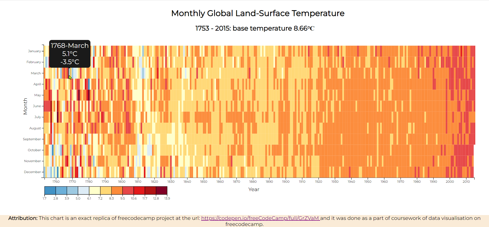

# D3 Heat Map - Global Land-Surface Temperature

This heat map shows the variation of temperature at a certain month of the year. Different colors represent different range of temperatures.

It has a tooltip that shows more information on a point when you hover over the data point. The data point will also be  highlighted while hovering over it.

You can use the heat map for other your own data by customizing your data similar to the url in the variable url. and then replace the url with your own url. You can choose your own colors by changing the colorList array. You can give any number of colors, the program will take care of the rest. If you want to positon the chart, change the margin.top and margin.left variables.

Check out the deployed page at Netlify:

**Attribution:** This chart is an exact replica of freecodecamp project at the url: [https://codepen.io/freeCodeCamp/full/GrZVaM](https://codepen.io/freeCodeCamp/full/GrZVaM) and it was done as a part of coursework of data visualisation on freecodecamp.

A Pen created on CodePen.io. Original URL: [https://codepen.io/sathishkannan/pen/bGMLJjE](https://codepen.io/sathishkannan/pen/bGMLJjE).